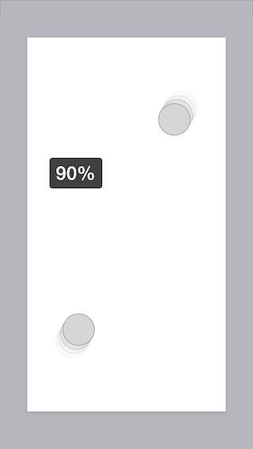

#Handedness

---

##MTZHandyPinchGestureRecognizer

A handy `UIPinchGestureRecognizer` subclass that makes it easy to find handedness of the gesture.

If the user pinches with their right-hand, the zoom-level popover will appear on screen left of their hand instead of appearing obstructed by their hand.

---

This repo includes header and implementation files as well as example code on how to handle views accordingly.

####How it works

When `touchesMoved:withEvent:` is invoked on `MTZHandyPinchGestureRecognizer`, it first needs to make sure `UIPinchGestureRecognizer` handles it accordingly. If `UIPinchGestureRecognizer` decides that the movement of touches is enough to be categorized as a pinch, it will set its state to `UIGestureRecognizerStateBegan`.
If the state is `UIGestureRecognizerStateBegan`, `MTZHandyPinchGestureRecognizer` will try to figure out the handedness of the (two) touches.

The handedness of touches is determined with the method `determineHandedness`. This method expects exactly two touches to be given. With the two UITouch objects, the top and bottom fingers are decided. If there isn't enough of a difference between the y component of the two touches, it's probably better to not assume too much which hand is being used to activate the gesture, and handedness is immediately set to `MTZHandednessUnknown`. If the top finger is further right (larger x component), it is determined to be right handedness (`MTZHandednessRight`). If the top finger is further left (smaller x component), it is determined to be left handedness (`MTZHandednessLeft`). Again, if there is not enough difference between the two fingers in their x component, handedness is unknown (`MTZHandednessUnknown`).

####What can/should be done with this

One example of the usefulness of this class is being able to intelligently place view around the fingers so that the view is not obscured by the users hand or fingers. On devices with smaller displays, like iPhone and iPod touch, this is even more critical as a user's hands and fingers can cover a large portion of the display.

In this project, I create an example of the situation above. There is a UIView that is scaled (zoomed) upon pinching. When pinching, there is a popover view that shows the current zoom. When showing the popover, using the center and handedness properties of the gesture, the view is moved either left or right (away from the hand) so that it is always visible.

####What should *not* been done with this

All uses of this (and possible future versions) class should be subtle. Views should *not* fly around the users fingers. Instead, this class should be used to improve expected behaviour and prevent accidental unexpected behaviour. The included example is an appropriate way of using this data. Users will likely not even notice that the popover view is positioned more appropriately with this data. Instead, the interface is simply what the user *expected*. Please keep this in mind when using this. Thank you.

####The Future

* It would be nice to be able to move this code to be applicable to almost any gesture.

Where advances in hardware could be useful:

* It would also be nice to be able to have access to more primitive data about the touch and possibly determine the handedness based on the shape of each touch (using a very similar algorithm this may be able to be determined).

* If hardware technology were able to tell when things are in near proximity to the display, detecting areas where the screen are obstructed would be trivial. "Shadows" of the users fingers could be made and this class could be rebuilt.

